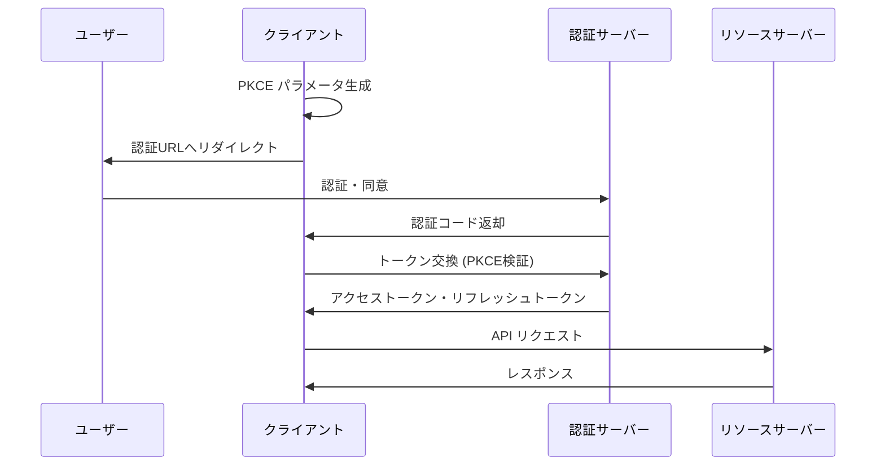

# OAuth 2.0 フロー実装ガイド

このドキュメントでは、Gmail と Google Drive API 統合のための OAuth 2.0 + PKCE 認証フローの実装について説明します。

## 概要

freee レシート自動化システムでは、Gmail メッセージの読み取りとGoogle Drive ファイル操作のために、OAuth 2.0 Authorization
Code Flow with PKCE を使用します。

### 主要機能

- **PKCE (Proof Key for Code Exchange)** によるセキュアな認証
- **AES-256-GCM 暗号化** によるトークンの安全な保存
- **自動トークンリフレッシュ** による継続的なアクセス
- **Supabase 統合** による一元的なユーザー管理

## OAuth フロー図



## 実装詳細

### 1. 認証フロー開始

認証フローは以下のパラメータでGoogle認証サーバーへのリダイレクトを生成します：

**必須パラメータ**:

- `client_id`: Google OAuth クライアントID
- `redirect_uri`: コールバックURL
- `response_type`: `code` (認証コードフロー)
- `scope`: 必要なアクセス許可
- `state`: CSRF攻撃防止用ランダム文字列
- `code_challenge`: PKCE チャレンジ
- `code_challenge_method`: 常に `S256`
- `access_type`: リフレッシュトークン取得のため `offline`
- `prompt`: リフレッシュトークン確実取得のため `consent`

**認証URL例**:

```url
https://accounts.google.com/o/oauth2/v2/auth?
  client_id=123456789.apps.googleusercontent.com&
  redirect_uri=https://app.example.com/auth/callback&
  response_type=code&
  scope=https://www.googleapis.com/auth/gmail.readonly%20https://www.googleapis.com/auth/drive.file&
  state=random_state_string&
  code_challenge=challenge_string&
  code_challenge_method=S256&
  access_type=offline&
  prompt=consent
```

### 2. コールバック処理

認証サーバーからの認証コードを受け取り、アクセストークンと交換します。

**コールバックレスポンス例**:

```json
{
  "authorizationUrl": "https://accounts.google.com/o/oauth2/v2/auth?...",
  "state": "secure_random_state",
  "codeChallenge": "pkce_challenge",
  "codeChallengeMethod": "S256"
}
```

**トークン交換レスポンス例**:

```json
{
  "accessToken": "ya29.a0ARrd...",
  "refreshToken": "1//04_refresh_token",
  "expiresIn": 3600,
  "tokenType": "Bearer",
  "scope": "https://www.googleapis.com/auth/gmail.readonly https://www.googleapis.com/auth/drive.file"
}
```

## スコープ設定

### Gmail 統合

- `https://www.googleapis.com/auth/gmail.readonly`: Gmail メッセージ読み取り
- `https://www.googleapis.com/auth/gmail.modify`: メッセージ変更
- `https://www.googleapis.com/auth/gmail.metadata`: メタデータアクセス

### Drive 統合

- `https://www.googleapis.com/auth/drive.file`: 作成したファイルの管理
- `https://www.googleapis.com/auth/drive.metadata.readonly`: メタデータ読み取り
- `https://www.googleapis.com/auth/drive.readonly`: ドライブ読み取り

## セキュリティ実装

### PKCE (Proof Key for Code Exchange)

PKCEは、認証コードの傍受攻撃を防ぐためのセキュリティ拡張です。

**実装手順**:

1. **Code Verifier 生成**: 43-128文字のランダム文字列
2. **Code Challenge 生成**: Code VerifierのSHA256ハッシュをBase64URL エンコード
3. **認証要求**: Code Challengeを含めて認証URLを生成
4. **トークン交換**: Code Verifierで検証してトークン取得

### トークン暗号化

アクセストークンとリフレッシュトークンは、AES-256-GCM暗号化でSupabaseに安全に保存されます。

**暗号化仕様**:

- **アルゴリズム**: AES-256-GCM
- **キー導出**: scrypt (環境変数 `OAUTH_ENCRYPTION_KEY`)
- **初期化ベクトル**: ランダム生成16バイト
- **認証タグ**: 改竄検出用

## API クォータと制限

### Gmail API クォータ

- **日次クォータ**: 1,000,000,000 クォータユニット/日
- **リクエストレート**: 250 クォータユニット/ユーザー/100秒
- **同時リクエスト**: 100 リクエスト/ユーザー

### Drive API クォータ

- **日次クォータ**: 10,000,000 クエリ/日
- **リクエストレート**: 100 リクエスト/100秒/ユーザー
- **アップロード**: 750 リクエスト/100秒/ユーザー

## エラーハンドリング

OAuthフローでの一般的なエラーとその対処法：

### 認証エラー

- `invalid_client`: クライアント認証失敗
- `unauthorized_client`: クライアント認証未承認
- `access_denied`: ユーザーがアクセス拒否
- `invalid_grant`: 認証コードが無効または期限切れ
- `invalid_scope`: 要求したスコープが無効

### トークン管理エラー

- `token_expired`: アクセストークン期限切れ → 自動リフレッシュ
- `refresh_token_expired`: リフレッシュトークン期限切れ → 再認証要求
- `insufficient_scope`: 必要なスコープが不足

## テスト戦略

### 1. ユニットテスト

- PKCE パラメータ生成
- トークン暗号化/復号化
- スコープバリデーション
- エラーハンドリング

### 2. 統合テスト

- 完全なOAuth フロー シミュレーション
- トークンリフレッシュフロー
- API クライアント作成

### 3. セキュリティテスト

- CSRF攻撃防止
- トークン傍受防止
- スコープエスカレーション防止

## 準拠基準

### OAuth2.0 標準

- **RFC 6749**: OAuth 2.0 Authorization Framework
- **RFC 7636**: PKCE for OAuth Public Clients
- **RFC 6750**: Bearer Token Usage

### Google API ガイドライン

- [Google OAuth2.0 ドキュメント](https://developers.google.com/identity/protocols/oauth2)
- [Gmail API ガイド](https://developers.google.com/gmail/api)
- [Drive API ガイド](https://developers.google.com/drive/api)

## 監視とアラート

### 主要メトリクス

- OAuth フロー成功/失敗率
- トークンリフレッシュ頻度
- API クォータ使用率
- 認証エラー発生率

### ログ要件

- 全OAuth リクエスト（機密情報除く）
- トークンリフレッシュイベント
- 認証失敗とその理由
- スコープ不足エラー

### アラート設定

- 高いOAuth 失敗率
- クォータ使用率 80% 超過
- リフレッシュトークン期限切れ頻発
