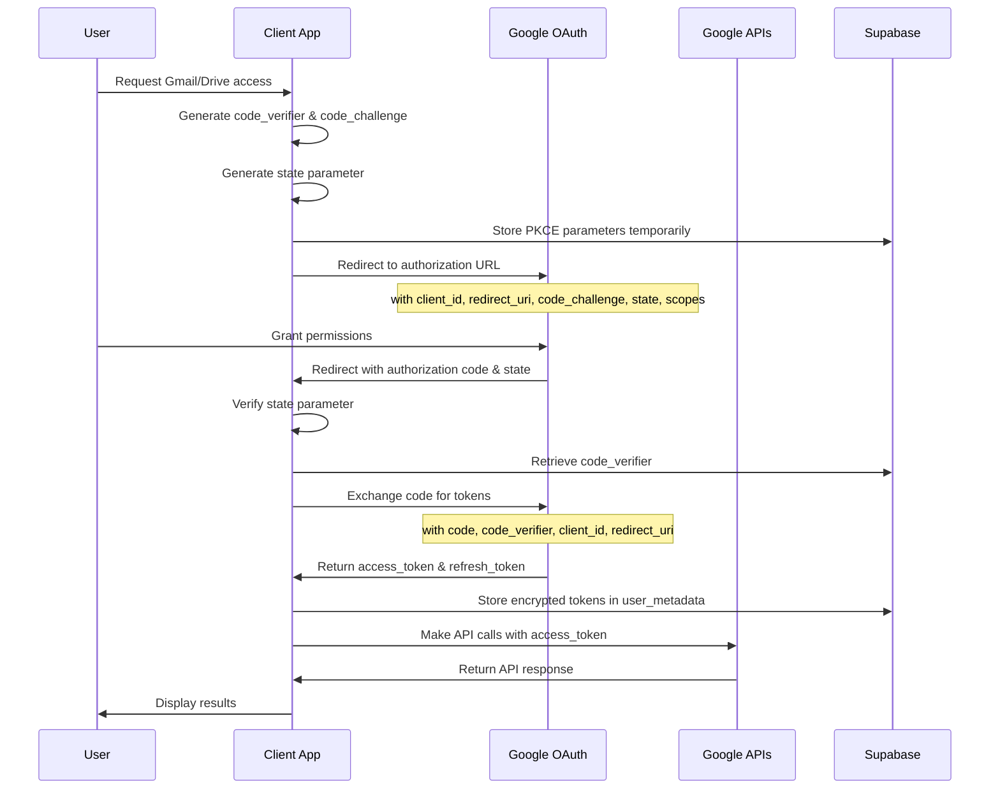
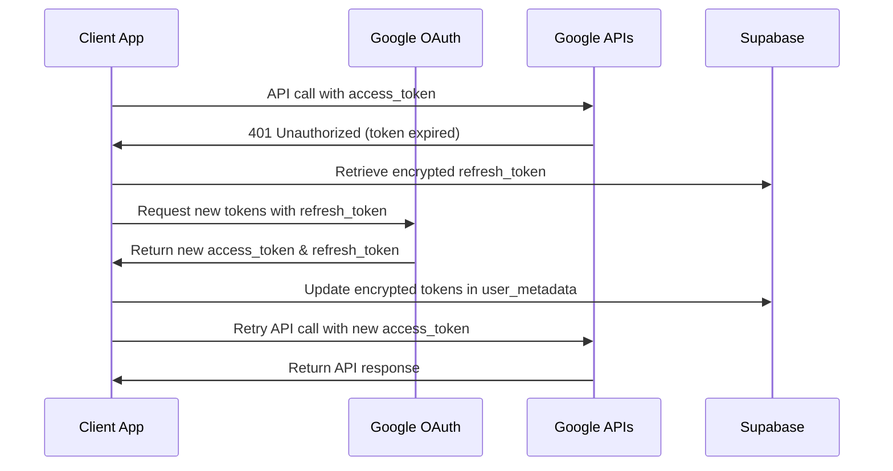

# OAuth2.0 Authentication Flows

This document describes the OAuth2.0 authentication flows implemented for Gmail and Google Drive integration.

## Overview

The freee Receipt Automation system uses **OAuth2.0 Authorization Code flow with PKCE (Proof Key for Code Exchange)** for secure authentication with Google services. This approach provides enhanced security for public clients and single-page applications.

## Security Architecture

### Core Components

1. **Authorization Server**: Google OAuth2.0 service
2. **Client Application**: freee Receipt Automation (Next.js app)
3. **Resource Servers**: Gmail API v1, Drive API v3
4. **User Agent**: Web browser
5. **Token Storage**: Supabase user metadata (encrypted)

### Security Features

- **PKCE Implementation**: Prevents authorization code interception attacks
- **State Parameter**: CSRF protection for authorization requests
- **Refresh Token Rotation**: Automatic token refresh with rotation
- **Scope Limitation**: Minimal required permissions only
- **Encrypted Storage**: Tokens stored encrypted in Supabase

## Flow Diagrams

### 1. Authorization Code Flow with PKCE



### 2. Token Refresh Flow



## Implementation Details

### 1. Authorization Request

**Endpoint**: `/api/auth/oauth/initiate`

**Parameters**:
- `client_id`: Google OAuth client ID
- `redirect_uri`: Application callback URL
- `response_type`: Always `code`
- `scope`: Requested permissions (space-separated)
- `state`: CSRF protection token
- `code_challenge`: PKCE challenge (base64url-encoded SHA256 hash)
- `code_challenge_method`: Always `S256`
- `access_type`: `offline` for refresh token
- `prompt`: `consent` to ensure refresh token

**Example Authorization URL**:
```
https://accounts.google.com/o/oauth2/v2/auth?
  client_id=123456789.apps.googleusercontent.com&
  redirect_uri=https://app.example.com/auth/callback&
  response_type=code&
  scope=https://www.googleapis.com/auth/gmail.readonly%20https://www.googleapis.com/auth/drive.file&
  state=xyz123&
  code_challenge=E9Melhoa2OwvFrEMTJguCHaoeK1t8URWbuGJSstw-cM&
  code_challenge_method=S256&
  access_type=offline&
  prompt=consent
```

### 2. Token Exchange

**Endpoint**: `/api/auth/oauth/callback`

**Request Body**:
```json
{
  "code": "4/0AX4XfWjYZ...",
  "state": "xyz123",
  "codeVerifier": "dBjftJeZ4CVP-mB92K27uhbUJU1p1r_wW1gFWFOEjXk",
  "redirectUri": "https://app.example.com/auth/callback"
}
```

**Token Request to Google**:
```json
{
  "client_id": "123456789.apps.googleusercontent.com",
  "client_secret": "client_secret",
  "code": "4/0AX4XfWjYZ...",
  "grant_type": "authorization_code",
  "redirect_uri": "https://app.example.com/auth/callback",
  "code_verifier": "dBjftJeZ4CVP-mB92K27uhbUJU1p1r_wW1gFWFOEjXk"
}
```

### 3. Token Storage

Tokens are stored encrypted in Supabase `auth.users.user_metadata`:

```json
{
  "google_oauth": {
    "access_token": "encrypted_access_token",
    "refresh_token": "encrypted_refresh_token",
    "expires_at": "2024-06-20T12:00:00Z",
    "scope": "https://www.googleapis.com/auth/gmail.readonly https://www.googleapis.com/auth/drive.file",
    "token_type": "Bearer"
  }
}
```

## Required Scopes

### Gmail Integration
- `https://www.googleapis.com/auth/gmail.readonly`
  - Read Gmail messages and attachments
  - Search for emails with attachments
  - Download receipt attachments

### Drive Integration
- `https://www.googleapis.com/auth/drive.file`
  - Create, read, update, and delete files created by the app
  - Upload processed receipts
  - Manage receipt file permissions

- `https://www.googleapis.com/auth/drive.metadata.readonly` (optional)
  - Read file metadata for better organization
  - Access file creation and modification dates

## Security Considerations

### 1. PKCE Implementation

```typescript
// Generate code verifier (43-128 characters)
const codeVerifier = base64URLEncode(crypto.randomBytes(32));

// Generate code challenge
const codeChallenge = base64URLEncode(
  crypto.createHash('sha256').update(codeVerifier).digest()
);
```

### 2. State Parameter Validation

```typescript
// Generate cryptographically secure state
const state = crypto.randomBytes(16).toString('hex');

// Store state temporarily (Redis/memory, 10-minute expiry)
await storeTemporaryState(userId, state, { expiresIn: 600 });

// Validate state in callback
const storedState = await getTemporaryState(userId);
if (storedState !== receivedState) {
  throw new Error('Invalid state parameter');
}
```

### 3. Token Encryption

```typescript
// Encrypt tokens before storage
const encryptedTokens = await encrypt(tokens, process.env.ENCRYPTION_KEY);

// Store in Supabase user metadata
await supabase.auth.updateUser({
  data: { google_oauth: encryptedTokens }
});
```

### 4. Automatic Token Refresh

```typescript
// Check token expiry before API calls
if (isTokenExpired(accessToken)) {
  const newTokens = await refreshTokens(refreshToken);
  await updateStoredTokens(userId, newTokens);
  accessToken = newTokens.accessToken;
}
```

## Rate Limiting & Quotas

### Gmail API Quotas
- **Daily Quota**: 1,000,000,000 quota units
- **Per User Rate Limit**: 250 quota units per user per 100 seconds
- **Batch Requests**: Recommended for bulk operations

### Drive API Quotas
- **Daily Quota**: 10,000,000,000 quota units  
- **Per User Rate Limit**: 1,000 requests per 100 seconds per user
- **Upload Size Limit**: 5TB per file

### Rate Limiting Strategy

1. **Exponential Backoff**: Retry failed requests with increasing delays
2. **Queue Management**: Queue API requests to stay within limits
3. **Quota Monitoring**: Track usage and implement circuit breakers
4. **User Notification**: Inform users when rate limits are approached

## Error Handling

### Common OAuth Errors

| Error Code | Description | Resolution |
|------------|-------------|------------|
| `invalid_request` | Invalid authorization request | Validate all required parameters |
| `unauthorized_client` | Client not authorized | Check client credentials |
| `access_denied` | User denied access | Request user to grant permissions |
| `invalid_grant` | Invalid authorization code | Ensure code is not expired/reused |
| `invalid_scope` | Requested scope invalid | Use only supported scopes |

### Token Refresh Errors

| Error Code | Description | Resolution |
|------------|-------------|------------|
| `invalid_grant` | Refresh token invalid/expired | Re-authenticate user |
| `unauthorized_client` | Client credentials invalid | Check client configuration |

## Testing Strategy

### 1. Unit Tests
- PKCE parameter generation
- State parameter validation
- Token encryption/decryption
- Error handling scenarios

### 2. Integration Tests
- Complete OAuth flow simulation
- Token refresh functionality
- API calls with tokens
- Error recovery mechanisms

### 3. Security Tests
- CSRF attack prevention
- Token storage security
- Authorization code interception
- Refresh token rotation

## Compliance & Standards

### OAuth2.0 Standards
- **RFC 6749**: OAuth 2.0 Authorization Framework
- **RFC 7636**: PKCE Extension
- **RFC 6750**: Bearer Token Usage
- **RFC 7662**: Token Introspection

### Google API Guidelines
- [Google OAuth2.0 Documentation](https://developers.google.com/identity/protocols/oauth2)
- [Gmail API Authentication](https://developers.google.com/gmail/api/auth/web-server)
- [Drive API Authentication](https://developers.google.com/drive/api/v3/about-auth)

## Monitoring & Observability

### Key Metrics
- OAuth flow success/failure rates
- Token refresh frequency
- API call latency and error rates
- Rate limit threshold approaches

### Logging Requirements
- All OAuth requests (without sensitive data)
- Token refresh events
- API call failures
- Security incidents (invalid state, expired tokens)

### Alerting
- High OAuth failure rates
- Token refresh failures
- Rate limit threshold exceeded
- Unauthorized access attempts