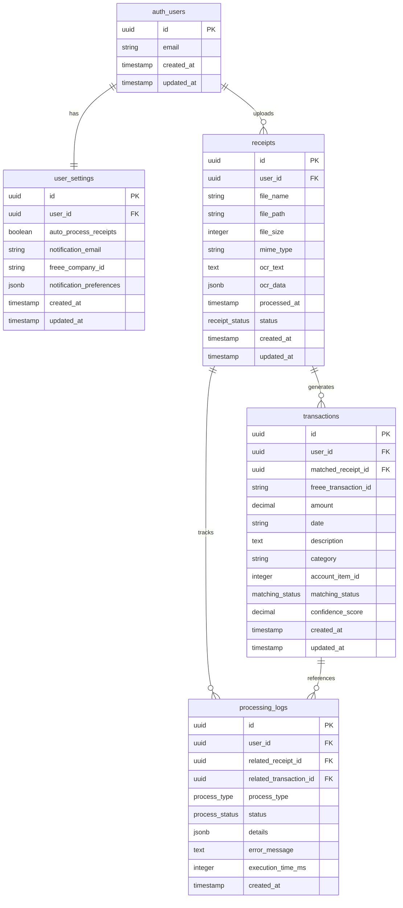

# データベーススキーマ概要

このドキュメントでは、freee領収書自動化システムのデータベーススキーマの概要を説明します。

## 設計思想

データベーススキーマは、領収書処理とfreee連携の主要ワークフローを中心に設計されており、
行レベルセキュリティ（RLS）によるデータセキュリティとユーザー分離を重視しています。

## エンティティ関係図

## スキーマコンポーネント

完全なスキーマドキュメントは以下のファイルに分割されています：

### 主要ドキュメント

- **[テーブル定義](table-definitions-ja.md)** - 詳細なテーブルスキーマと制約
- **[インデックスとパフォーマンス](indexes-performance-ja.md)** - データベースインデックスとクエリ最適化
- **[セキュリティポリシー](security-policies-ja.md)** - 行レベルセキュリティ（RLS）の実装
- **[マイグレーションガイド](migration-strategy-ja.md)** - データベースマイグレーション戦略とベストプラクティス

### 主な機能

- **PostgreSQL基盤**: JSONB、制約、トリガーなどPostgreSQLの高度な機能を活用
- **行レベルセキュリティ**: ユーザーが自分のデータのみにアクセスできるデータベースレベルのセキュリティ
- **JSONBストレージ**: OCRデータと通知設定のための柔軟なストレージ
- **監査証跡**: processing_logsテーブルによる包括的なログ記録
- **パフォーマンス最適化**: 一般的なクエリパターンに対する戦略的インデックス

## クイックリファレンス

### テーブル概要

| テーブル | 目的 | 主な機能 |
|---------|------|----------|
| `user_settings` | ユーザー設定とfreee連携設定 | auth.usersと1対1、JSONB設定 |
| `receipts` | 領収書ファイルメタデータと処理状況 | ファイルストレージ、OCR結果、ステータス追跡 |
| `transactions` | freeeトランザクションデータとマッチング情報 | 高精度の金額、信頼度スコア |
| `processing_logs` | すべての処理操作の監査証跡 | パフォーマンス追跡、エラー記録 |

### データ型

- **カスタム列挙型**: `receipt_status`、`matching_status`、`process_type`、`process_status`
- **JSONBフィールド**: 構造化データ（OCR結果、設定）の柔軟なストレージ
- **UUID**: プライマリキーと外部キー参照
- **DECIMAL**: 正確な金額表現

## マイグレーション戦略

すべてのスキーマ変更は連番のマイグレーションファイルで管理されます：

1. `001_core_tables.sql` - user_settingsとreceiptsを含む初期スキーマ
2. `002_transaction_tables.sql` - transactionとprocessing_logsテーブル
3. `003_rls_policies.sql` - 行レベルセキュリティポリシー

## 次のステップ

詳細な実装については：

1. 完全なSQLスキーマは[テーブル定義](table-definitions-ja.md)を確認
2. RLS実装は[セキュリティポリシー](security-policies-ja.md)を確認
3. 最適化の詳細は[インデックスとパフォーマンス](indexes-performance-ja.md)を確認

---

最終更新日: 2024-06-19
