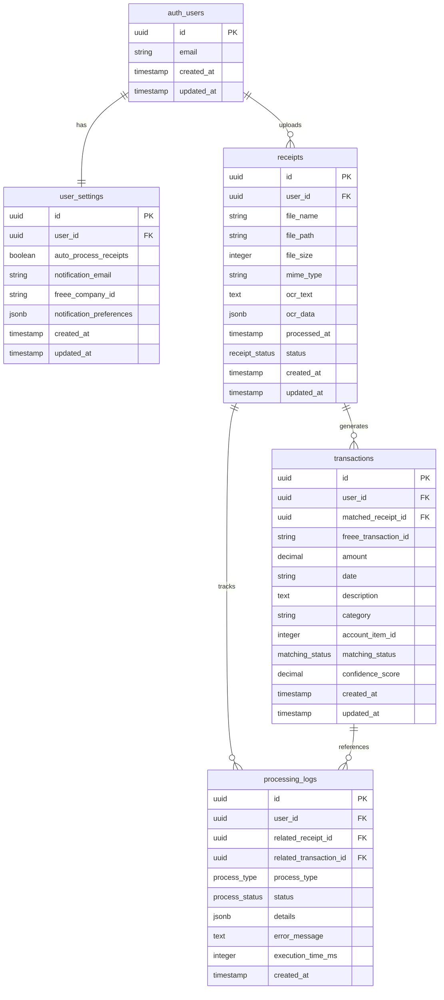

# Database Schema Overview

This document provides an overview of the database schema for the freee Receipt Automation system.

## Design Philosophy

The database schema is designed around the core workflow of receipt processing and freee integration, with strong
emphasis on data security and user isolation through Row Level Security (RLS).

## Entity Relationship Diagram

## Schema Components

The complete schema documentation is split across several files:

### Core Documentation

- **[Table Definitions](table-definitions.md)** - Detailed table schemas and constraints
- **[Indexes and Performance](indexes-performance.md)** - Database indexes and query optimization
- **[Security Policies](security-policies.md)** - Row Level Security (RLS) implementation
- **[Migration Guide](migration-strategy.md)** - Database migration strategy and best practices

### Key Features

- **PostgreSQL Foundation**: Leverages PostgreSQL's advanced features including JSONB, constraints, and triggers
- **Row Level Security**: Database-level security ensuring users can only access their own data
- **JSONB Storage**: Flexible storage for OCR data and notification preferences
- **Audit Trail**: Comprehensive logging through processing_logs table
- **Performance Optimized**: Strategic indexes for common query patterns

## Quick Reference

### Table Summary

| Table | Purpose | Key Features |
|-------|---------|--------------|
| `user_settings` | User preferences and freee integration config | One-to-one with auth.users, JSONB preferences |
| `receipts` | Receipt file metadata and processing status | File storage, OCR results, status tracking |
| `transactions` | freee transaction data and matching info | Decimal precision, confidence scoring |
| `processing_logs` | Audit trail for all processing operations | Performance tracking, error capture |

### Data Types

- **Custom Enums**: `receipt_status`, `matching_status`, `process_type`, `process_status`
- **JSONB Fields**: Flexible storage for structured data (OCR results, preferences)
- **UUID**: Primary keys and foreign key references
- **DECIMAL**: Precise monetary amounts

## Migration Strategy

All schema changes are managed through sequential migration files:

1. `001_core_tables.sql` - Initial schema with user_settings and receipts
2. `002_transaction_tables.sql` - Transaction and processing_logs tables
3. `003_rls_policies.sql` - Row Level Security policies

## Next Steps

For detailed implementation:

1. Review [Table Definitions](table-definitions.md) for complete SQL schemas
2. Check [Security Policies](security-policies.md) for RLS implementation
3. See [Indexes and Performance](indexes-performance.md) for optimization details

---

Last updated: 2024-06-19
